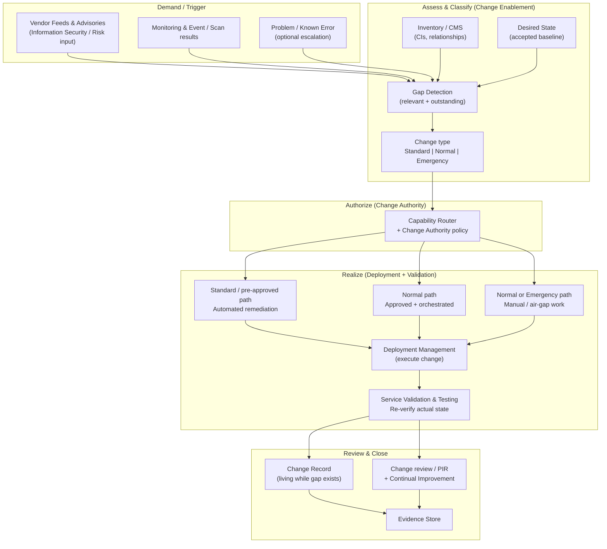
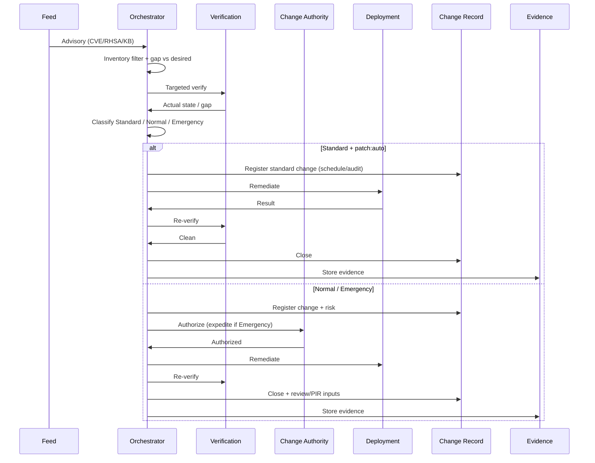
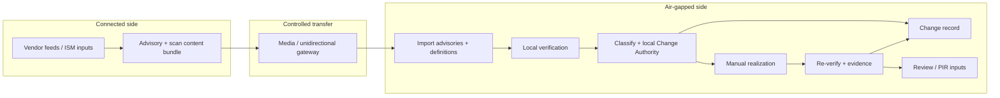

# Enterprise Patch & Vulnerability Orchestration Architecture

**Scope:** Environments that range from fully automated enterprise estates to austere and air-gapped labs.

**Core principle:** Vulnerability scanning capability is assumed to be widely available. Automated patching capability is variable. The workflow must route correctly for both.

**Status:** Design document. No implementation until reviewed and approved.

**Document version:** 1.1 — ITIL 4–aligned enterprise approach.

---

## 1. Problem Statement

“Is it patched?” is not a binary question. It is the intersection of:

1. **Feed / Advisory** — What did the vendor publish?
2. **Inventory** — What do we claim to have? (configuration items / assets)
3. **Actual state** — What is really present on the host right now?
4. **Desired state** — What have we decided must be present?
5. **Remediation capability** — Can this host/tier be patched automatically, semi-automatically, or only manually?

Scanning is relatively uniform. Patching is not. The architecture treats scanning as the common verification layer and patching as a routed capability, consistent with ITIL 4’s risk-based change enablement rather than a single rigid process.

---

## 2. Capability Tiers

| Tier | Scanning | Patching | Typical environment |
|------|----------|----------|---------------------|
| **A – Robust** | Automated (Nessus, Satellite, agent, cloud) | Automated or highly orchestrated (Satellite, MECM, Ansible, WSUS rings) | Production enterprise, well-managed labs |
| **B – Semi-automated** | Automated or scheduled | Partial automation + human approval / manual execution | Mixed estates, regulated segments |
| **C – Austere** | Available (scanner or agent) but may be intermittent | Manual or limited tooling | Small labs, remote sites, constrained networks |
| **D – Air-gap** | Manual or sneakernet scanner results | Fully manual | Isolated networks, classified/controlled environments |

The same advisory may take different paths for different hosts or tiers inside one organization.

---

## 3. Conceptual Model (ITIL-aligned)

**ITIL mapping (high level):** Demand is often driven by Information Security Management and Monitoring & Event Management; assessment and authorization sit in Change Enablement; execution aligns with Deployment Management; confirmation aligns with Service Validation and Testing; learning feeds Continual Improvement. Problem Management may own systemic vulnerability themes; individual remediation of a known gap is typically a **change**, not an incident (unless service is already impaired).

---

## 4. ITIL 4 Alignment and Verification

### 4.1 Primary practice: Change Enablement

**ITIL 4 purpose (Change Enablement):**  
*“To maximize the number of successful service and product changes by ensuring that risks have been properly assessed, authorizing changes to proceed, and managing the change schedule.”*  
— AXELOS, *ITIL 4 Change Enablement Practice Guide* / ITIL 4 Foundation practice statements.

**Change lifecycle management activities** (ITIL 4 practice guidance) map as follows:

| ITIL 4 activity | This architecture |
|-----------------|-------------------|
| Change registration | Gap record + open/update change record when gap is confirmed |
| Change assessment | Feed relevance + inventory + actual state + risk/severity + capability tag |
| Change authorization | Capability router + designated Change Authority (policy, peer, CAB, or automated pre-approval) |
| Change planning | Maintenance window, wave order, recovery path, schedule conflict check |
| Change realization control | Remediation execution (auto or manual) under the chosen path |
| Change review and closure | Mandatory re-verification + post-implementation review (PIR) inputs; close only when gap is cleared |

**Change types (ITIL 4)** — required alignment:

| ITIL type | Definition (summary) | Mapping in this architecture |
|-----------|----------------------|------------------------------|
| **Standard** | Pre-authorized, low-risk, well-understood, often automated; follows a documented procedure | `patch:auto` where the specific remediation is pre-approved as a standard change model (e.g., pilot CV, known KB set, documented runbook). No per-instance CAB. |
| **Normal** | Not standard and not emergency; requires assessment and authorization appropriate to risk | `patch:approved-auto`, `patch:orchestrated`, `patch:manual` — change record, risk assessment, Change Authority approval, then realization |
| **Emergency** | Must be implemented as soon as possible (e.g., critical security exposure or major incident) | High-severity gaps with expedited Change Authority (or ECAB-equivalent); still documented; post-implementation review required. May still be auto or manual depending on capability tag. |

**Findings and corrections applied in v1.1:**

1. **Change type was implicit; now explicit.** Capability tags alone are operational routing; ITIL requires classifying Standard / Normal / Emergency. The router now combines *capability* (can we automate?) with *change type* (what governance applies?).
2. **Change Authority was underspecified.** Authorization is not “the ticket system”; it is a defined person/group/policy (including automated authorization for Standard changes). Diagram and router updated.
3. **Review & closure needed PIR linkage.** Re-verify closes the *gap*; change review / PIR feeds Continual Improvement and may update standard-change models or desired state. Added to model.
4. **Incident vs Change vs Problem clarified.** A detected vulnerability gap is not automatically an Incident (no service impairment assumed). It is typically a candidate Change. Recurring or systemic issues may be managed as Problems/Known Errors that *trigger* changes. Security events may raise Incidents *and* drive emergency changes.

### 4.2 Related ITIL 4 practices

| Practice | Purpose (summary) | Role in this architecture |
|----------|-------------------|---------------------------|
| **Information Security Management** | Protect information needed by the organization (confidentiality, integrity, availability) | Primary source of vulnerability/advisory demand; severity and risk context |
| **Monitoring and Event Management** | Systematically observe services and components; record and manage selected events | Scan results, errata applicability, agent events as triggers and actual-state inputs |
| **Service Configuration Management** | Ensure accurate, reliable information about CIs and relationships | Inventory / CMS used in applicability filtering and impact assessment |
| **IT Asset Management** | Lifecycle of IT assets | Complements inventory for ownership and support status |
| **Deployment Management** | Move new or changed components to live (or other) environments | Remediation execution engines (Satellite, MECM, Ansible, manual install) |
| **Release Management** | Make new and changed services/features available for use | Optional packaging of patch waves as releases where the organization uses release constructs |
| **Service Validation and Testing** | Ensure products and services meet agreed requirements | Mandatory re-verification after realization; “patched” definition |
| **Incident Management** | Minimize impact of incidents; restore normal operation | Only when vulnerability is actively impairing service or is exploited |
| **Problem Management** | Reduce likelihood/impact of incidents by managing causes, workarounds, known errors | Systemic vulnerability themes, repeated gaps, root-cause beyond a single advisory |
| **Continual Improvement** | Align practices and services with changing needs | PIR outcomes, standard-change model updates, desired-state evolution |
| **Risk Management** | (General management) | Informs severity handling and emergency vs normal classification |

Sources for practice purposes: AXELOS ITIL 4 Foundation and practice guides (Change Enablement, and the standard purpose statements for the practices listed above).

### 4.3 Service Value Chain contribution

Change Enablement (and this architecture) contributes primarily to:

- **Obtain/build** — implementing the fix  
- **Design and transition** — controlled introduction of change  
- **Deliver and support** — protecting live services  
- **Improve** — reducing risk and refining models  

(ITIL 4 Service Value System / Service Value Chain; Change Enablement practice guidance on value stream contribution.)

### 4.4 What remains intentionally outside pure ITIL process language

- **Feed-driven targeted scanning** is a technical pattern that *feeds* Monitoring & Event and Information Security inputs; ITIL does not prescribe Nessus/CSAF mechanics.
- **Air-gap and austere tiers** are operational constraints; ITIL still expects registration, authorization (even if local), realization control, and review — which this design preserves with manual evidence.
- **Desired state** is an engineering control aligned with configuration baselines; formal CI attribute updates remain a Service Configuration Management concern.

---

## 5. End-to-End Workflow

### 5.1 Common front end (all tiers)

1. **Feed ingest** (or manual advisory import for air-gap)  
   - Normalize: CVE, RHSA/RHBA, KB, severity, products, packages, reboot flag, publication date.
2. **Inventory / CMS filter**  
   - Match product/version/CPE to configuration items.
3. **Targeted verification (actual state)**  
   - Feed supplies the *what*; scanner or native check supplies *is it present*.  
   - Nessus (CVE/plugin-targeted), Satellite `host_errata_info`, `win_updates`, agents, or imported scan files.
4. **Gap calculation**  
   - Desired vs actual, constrained by relevance.  
   - Output: gap record (hosts, advisory, sub-state, evidence).
5. **Classify change type**  
   - Standard / Normal / Emergency per policy (severity, exploitability, service impact, pre-approved model match).
6. **Authorize via Change Authority + capability router**  
   - Combine change type with capability tag (`patch:auto` … `patch:airgap`).

### 5.2 Capability router (operational) × Change type (governance)

| Capability tag | Typical ITIL change type | Action |
|----------------|--------------------------|--------|
| `patch:auto` | **Standard** (only if model is pre-approved) | Automated remediation in window; record for schedule/audit; re-verify; close |
| `patch:approved-auto` | **Normal** (or Emergency if expedited) | Change record + Change Authority approval → automated execution → re-verify |
| `patch:orchestrated` | **Normal** | Change record + runbook / semi-automated realization → re-verify |
| `patch:manual` | **Normal** (or Emergency) | Change record + assigned manual work + evidence requirements → re-verify |
| `patch:airgap` | **Normal** or **Emergency** (local authority) | Local/replicated record; manual realization; imported verification evidence |

**Rule:** Automation never bypasses Standard-change pre-approval rules. A `patch:auto` host still requires that *this class of remediation* is an accepted standard change; otherwise treat as Normal.

### 5.3 Dynamic change record lifecycle

- Gap confirmed → register/update **change record** (link advisory, CIs, risk, type, authority, evidence).
- Gap remains → record stays active; append status and evidence.
- Realization attempted → update record.
- Re-verification succeeds → close change; trigger light **change review** / PIR inputs where policy requires (especially Normal and Emergency).
- Record is a living reflection of the gap and the change, not a one-shot request.

### 5.4 Re-verification (mandatory)

Aligns with **Service Validation and Testing** and Change Enablement “review and closure.”  
After any realization path, re-run verification. Only successful re-verification clears the gap and closes the change.

---

## 6. Tier-Specific Patterns

### 6.1 Robust (Tier A)

### 6.2 Austere (Tier C)

Same classification and registration. Realization is manual or limited tooling. Change Authority may be local. Closure still requires verification evidence attached to the change record.

### 6.3 Air-gap (Tier D)

ITIL expectations (register, assess, authorize, realize, review) remain; mechanisms are manual and evidence-centric.

---

## 7. Data Contracts (minimum)

### Gap / change-oriented record

| Field | Purpose |
|-------|---------|
| `advisory_id` | CVE / RHSA / KB / vendor ID |
| `severity` / risk | From feed + local risk context |
| `hosts[]` / CI refs | Affected configuration items |
| `change_type` | `standard` \| `normal` \| `emergency` |
| `capability_tag` | `patch:auto` … `patch:airgap` |
| `change_authority` | Policy, role, or group that authorized |
| `desired_ref` | Desired-state version |
| `actual_evidence` | Scan ID, plugin results, errata status, KB list, import hash |
| `sub_state` | applicable-not-installed, installed-pending-reboot, installed-unvalidated, etc. |
| `change_record_id` | Living change record |
| `remediation_path` | Chosen realization path |
| `timestamps` | Detected, authorized, realized, re-verified, closed, reviewed |

### Desired state

Versioned, reviewable baselines. Updated deliberately (often via Continual Improvement or accepted standard-change model changes)—not unilaterally by every feed item.

---

## 8. Definition of “Patched”

A host is **patched** for a given advisory when:

1. The advisory is relevant (feed + inventory/CI).  
2. Actual state shows the fix is present.  
3. Required reboot/service restart has completed (where applicable).  
4. Defined validation succeeds (Service Validation and Testing / agreed check), or residual risk is formally accepted.

Anything less remains an open gap with an explicit sub-state.

---

## 9. Routing Decision Table (summary)

| Gap? | Change type | Capability tag | Authorization | Realization | Closure |
|------|-------------|----------------|---------------|-------------|---------|
| No | — | any | — | — | — |
| Yes | Standard | `patch:auto` | Pre-approved model | Auto | Re-verify clean |
| Yes | Normal | `patch:approved-auto` | Change Authority | Auto after approval | Re-verify + review inputs |
| Yes | Normal | `patch:orchestrated` / `manual` | Change Authority | Orchestrated or manual | Re-verify + evidence |
| Yes | Emergency | any viable | Expedited authority | Fastest safe path | Re-verify + mandatory PIR inputs |
| Yes | any | `patch:airgap` | Local authority | Manual | Imported re-verify evidence |

---

## 10. Tooling Mapping (illustrative)

| Function | Robust | Austere | Air-gap |
|----------|--------|---------|---------|
| Feed / ISM input | RH Security Data / CSAF, MSRC, aggregator | Same or delayed bundle | Manual bundle import |
| Inventory / CMS | Satellite, CMDB, Hyper-V, AAP | Static + occasional sync | Offline extract |
| Verification | Nessus targeted, Satellite errata, win_updates, agents | Scanner/agent when available | Manual scanner + imported content |
| Deployment | Satellite, MECM, Ansible, cloud | Limited scripts + manual | Manual only |
| Change record | ServiceNow / Jira / etc. | Same or lightweight | Local tracker or delayed sync |
| Evidence | AAP artifacts, scan IDs, attachments | Operator uploads | Signed manifests, media logs, exports |

---

## 11. Design Rules (non-negotiable)

1. **Feed never installs.** Feed and scans inform; Change Enablement authorizes; Deployment realizes.  
2. **Verification is ubiquitous.** Every path ends with actual-state evidence (Service Validation and Testing).  
3. **Change type + capability tag together drive the path.** Governance and technical ability are separate axes.  
4. **Change Authority is explicit.** Including automated authority for true Standard changes.  
5. **Change record follows the gap.** Open while gap exists; close only after successful re-verification.  
6. **Emergency still reviews.** Expedite authorization and realization; do not skip registration or post-implementation review inputs.  
7. **Air-gap is first-class.** Manual verification and realization still satisfy register → authorize → realize → review.  
8. **Desired state is deliberate.** Continual Improvement and accepted models update it—not raw feed volume.  
9. **Evidence is durable.** Survives ticket reclamation, scanner rebuilds, and air-gap transfer.

---

## 12. Lab-to-Enterprise Scaling Path

| Stage | Focus |
|-------|--------|
| POC | Two hosts (one Standard/auto-capable, one Normal/manual). One feed. One change system. Explicit change type + capability tags. |
| Pilot ring | Prove classification, Change Authority, re-verify, dynamic change record, light PIR. |
| Production rings | Multi-feed, multi-scanner, schedule integration, Problem linkage for systemic issues. |
| Air-gap / austere | Bundle process, local authority, evidence standards, delayed sync if required. |

---

## 13. Relationship to This Repository

This document is the enterprise reference architecture. The lab POC implements a subset of Tier A/B patterns (Satellite, Windows pilot, ServiceNow PDI) and can exercise manual paths. Air-gap remains design-only until an isolated environment is in scope.

---

## 14. References

1. AXELOS, *ITIL Foundation, ITIL 4 Edition* — Service Value System, Service Value Chain, management practice purposes (Change Enablement, Incident Management, Problem Management, Deployment Management, Release Management, Service Validation and Testing, Monitoring and Event Management, Information Security Management, Service Configuration Management, Continual Improvement, etc.).
2. AXELOS, *ITIL 4 Change Enablement Practice Guide* — purpose statement; change types (Standard, Normal, Emergency); change lifecycle management activities (registration, assessment, authorization, planning, realization control, review and closure); Change Authority; integration with value streams.
3. AXELOS / PeopleCert, ITIL 4 Practitioner: Change Enablement syllabus and related materials — practice success factors, change models, standard change procedures.
4. Industry summaries consistent with the above (for cross-check only): ITSM.tools “Change Enablement – Change Management in ITIL 4”; ManageEngine and InvGate explainers on Standard / Normal / Emergency change types; Beyond20 overview of Change Enablement premises (value-stream context, risk-balanced throughput).
5. Complementary security context: ITIL 4 Information Security Management practice purpose; alignment discussions with vulnerability assessment and security-related emergency changes (e.g., critical patch as classic Emergency change example in multiple ITIL-oriented guides).

*Note: Official AXELOS practice guides are authoritative for wording of purposes and process activities. Secondary sources were used only to confirm widely accepted interpretations of Standard/Normal/Emergency handling and lifecycle steps.*

---

*Document version: 1.1 — Verified against ITIL 4 Change Enablement and related practices; diagrams and router updated for change type, Change Authority, and review/closure.*
