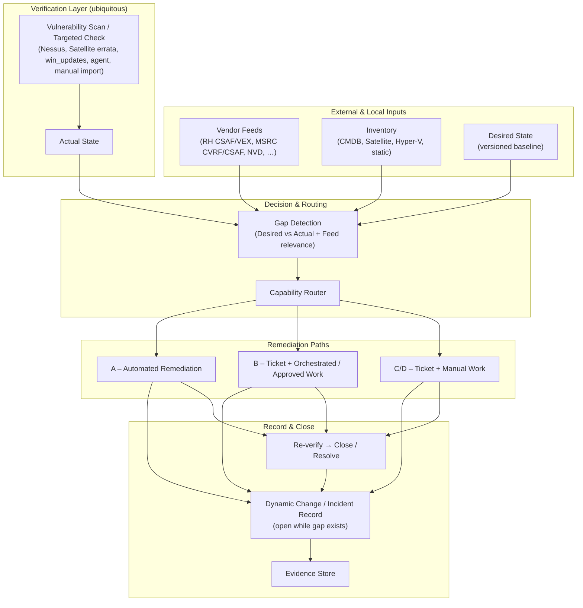
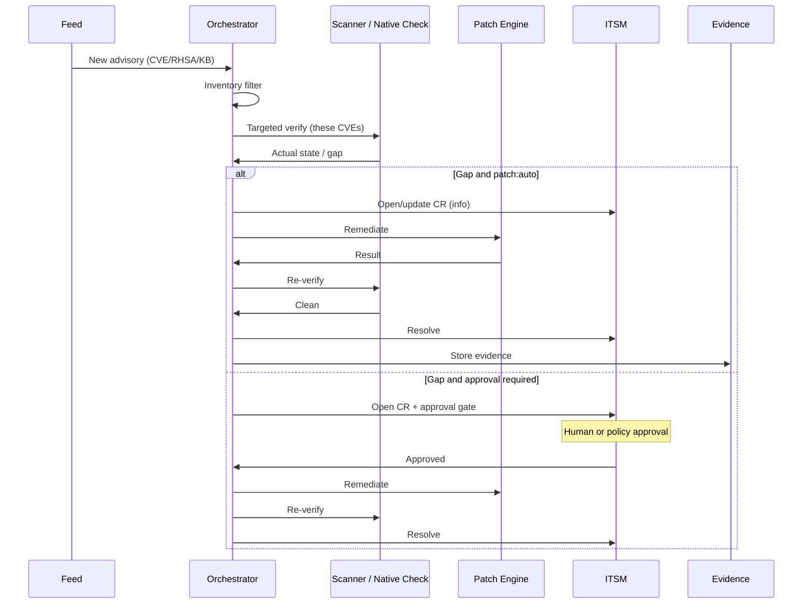
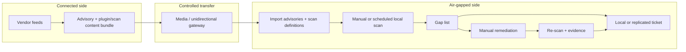

# Enterprise Patch & Vulnerability Orchestration Architecture

**Scope:** Environments that range from fully automated enterprise estates to austere and air-gapped labs.

**Core principle:** Vulnerability scanning capability is assumed to be widely available. Automated patching capability is variable. The workflow must route correctly for both.

**Status:** Design document. No implementation until reviewed and approved.

---

## 1. Problem Statement

“Is it patched?” is not a binary question. It is the intersection of:

1. **Feed / Advisory** — What did the vendor publish?
2. **Inventory** — What do we claim to have?
3. **Actual state** — What is really present on the host right now?
4. **Desired state** — What have we decided must be present?
5. **Remediation capability** — Can this host/tier be patched automatically, semi-automatically, or only manually?

Scanning is relatively uniform. Patching is not. The architecture must treat scanning as the common verification layer and treat patching as a routed capability.

---

## 2. Capability Tiers

| Tier | Scanning | Patching | Typical environment |
|------|----------|----------|---------------------|
| **A – Robust** | Automated (Nessus, Satellite, agent, cloud) | Automated or highly orchestrated (Satellite, MECM, Ansible, WSUS rings) | Production enterprise, well-managed labs |
| **B – Semi-automated** | Automated or scheduled | Partial automation + human approval / manual execution | Mixed estates, regulated segments |
| **C – Austere** | Available (scanner or agent) but may be intermittent | Manual or limited tooling | Small labs, remote sites, constrained networks |
| **D – Air-gap** | Manual or sneakernet scanner results | Fully manual | Isolated networks, classified/controlled environments |

The same advisory may take different paths for different hosts or tiers inside one organization.

---

## 3. Conceptual Model

---

## 4. End-to-End Workflow

### 4.1 Common front end (all tiers)

1. **Feed ingest** (or manual advisory import for air-gap)
   - Normalize to common identifiers: CVE, RHSA/RHBA, KB, severity, products, packages, reboot flag, publication date.
2. **Inventory filter**
   - Does any managed asset potentially match the product/version/CPE?
3. **Targeted verification**
   - Drive scanner or native check with the specific CVE/advisory list (feed = “what”; scanner = “verify”).
   - Sources of actual state: Nessus (plugin/CVE-targeted), Satellite `host_errata_info`, `win_updates` search, agent results, or manually imported scan files.
4. **Gap calculation**
   - Desired state vs actual state, constrained by feed relevance and inventory.
   - Output: clear gap record (host, advisory, sub-state, evidence pointers).

### 4.2 Capability router

After a gap is confirmed, route by host/tier capability tag:

| Capability tag | Action |
|----------------|--------|
| `patch:auto` | Attempt automated remediation (within policy and maintenance window). Re-verify. Close on success. |
| `patch:approved-auto` | Open/update change record, require explicit approval, then automated execution. |
| `patch:orchestrated` | Open/update change record, assign to automation or operator with runbook; execution may be semi-automated. |
| `patch:manual` | Open/update change record, assign for manual work; provide clear remediation guidance and evidence requirements. |
| `patch:airgap` | Open/update change record (or local tracking), package guidance + media requirements; accept manually imported verification results. |

Hosts or groups carry the capability tag in inventory. The router never assumes automation where the tag says otherwise.

### 4.3 Dynamic ticket lifecycle

- **Gap appears** → open or update change/incident record (link advisory, hosts, evidence, capability path).
- **Gap remains** → record stays open; updates append evidence and status.
- **Gap closed and re-verified** → resolve/close record.
- Ticket is a living reflection of the gap, not a one-shot request.

### 4.4 Re-verification (mandatory on all paths)

After any remediation attempt (auto or manual), re-run the same verification method. Only successful re-verification closes the gap and the record.

---

## 5. Tier-Specific Patterns

### 5.1 Robust (Tier A)

**Typical tools:** Satellite + AAP, MECM + Ansible, `win_updates`, Nessus/Tenable with API-driven targeted scans, ServiceNow (or equivalent).

### 5.2 Austere (Tier C)

- Same feed → filter → targeted scan path.
- Router sends gap to ticket with manual assignment and clear remediation steps.
- Operator performs patch (or uses limited local tooling).
- Operator or scheduled job imports/triggers re-scan results.
- Ticket closes only after verification evidence is attached.

### 5.3 Air-gap (Tier D)

- Feeds and (where licensed) scanner plugin updates are bundled on the connected side.
- Transfer is deliberate and audited.
- Scanning still occurs; it is just fed by imported content and often initiated manually.
- Patching is manual; evidence (scan delta, screenshots, logs, signed manifests) is the closure criterion.

---

## 6. Data Contracts (minimum)

### Gap record (travels with every decision)

| Field | Purpose |
|-------|---------|
| `advisory_id` | CVE / RHSA / KB / vendor ID |
| `severity` | From feed |
| `hosts[]` | Affected assets after inventory + actual-state filter |
| `capability_tag` | `patch:auto` … `patch:airgap` |
| `desired_ref` | Link to desired-state version |
| `actual_evidence` | Scan ID, plugin results, errata status, KB list, import hash |
| `sub_state` | applicable-not-installed, installed-pending-reboot, installed-unvalidated, etc. |
| `ticket_id` | Living change/incident record |
| `remediation_path` | Chosen route |
| `timestamps` | Detected, remediated, re-verified, closed |

### Desired state

Versioned, human-reviewable definition of required baselines (errata sets, KB baselines, package levels, config). Updated when the organization deliberately accepts a new standard—not automatically by every feed item.

---

## 7. Definition of “Patched” (enterprise-usable)

A host is **patched** for a given advisory when all of the following are true:

1. The advisory is relevant to the host (feed + inventory).
2. Actual state shows the fix is present (scan, errata status, or KB inventory).
3. Required reboot or service restart has completed (where applicable).
4. A defined validation check succeeds (service health, dependent system check, or accepted residual-risk record).

Anything less remains an open gap with an explicit sub-state.

---

## 8. Routing Decision Table (summary)

| Gap confirmed? | Capability tag | Approval required? | Action | Closure condition |
|----------------|----------------|--------------------|--------|-------------------|
| No | any | — | No ticket (or informational only) | — |
| Yes | `patch:auto` | Policy-dependent | Auto-remediate | Re-verify clean |
| Yes | `patch:approved-auto` | Yes | Ticket + approve + auto | Re-verify clean |
| Yes | `patch:orchestrated` | Usually | Ticket + runbook / semi-auto | Re-verify clean |
| Yes | `patch:manual` | Yes / assign | Ticket + manual work | Re-verify clean + evidence |
| Yes | `patch:airgap` | Local process | Local tracking + manual | Imported re-scan evidence |

---

## 9. Tooling Mapping (illustrative)

| Function | Robust | Austere | Air-gap |
|----------|--------|---------|---------|
| Feed ingest | RH Security Data / CSAF, MSRC API, aggregator | Same or delayed bundle | Manual bundle import |
| Inventory | Satellite, CMDB, Hyper-V, AAP | Static + occasional sync | Static / offline CMDB extract |
| Verification | Nessus targeted, Satellite errata, win_updates, agents | Nessus / OpenVAS / agent when available | Manual scanner + imported plugins/results |
| Remediation | Satellite, MECM, Ansible, cloud update | Limited scripts + manual | Manual only |
| Ticket | ServiceNow / Jira / etc. | Same or lightweight | Local tracker or delayed sync |
| Evidence | AAP artifacts, scan IDs, ticket attachments | Same + operator uploads | Signed manifests, media logs, scan exports |

---

## 10. Design Rules (non-negotiable)

1. **Feed never installs.** Feed only supplies candidates and enriches desired-state review.
2. **Verification is ubiquitous.** Every gap, every tier, every path ends with actual-state evidence.
3. **Capability tag drives routing.** No silent assumption of automation.
4. **Ticket follows the gap.** Open while gap exists; close only after successful re-verification.
5. **Air-gap is first-class.** Manual scan import and manual remediation are normal paths, not exceptions.
6. **Desired state is deliberate.** Feeds and scans inform it; they do not unilaterally change it.
7. **Evidence is durable.** Survives ticket-system reclamation, scanner rebuilds, and air-gap transfers.

---

## 11. Lab-to-Enterprise Scaling Path

| Stage | Focus |
|-------|--------|
| POC | Two hosts (one auto-capable, one manual). Single feed source. One ticket system. Explicit capability tags. |
| Pilot ring | Small set of hosts per tier. Prove router + re-verify + dynamic ticket. |
| Production rings | Expand desired-state coverage, add approval policies, multi-feed, multi-scanner. |
| Air-gap / austere | Formalize bundle process, evidence standards, and delayed ticket sync if required. |

---

## 12. Relationship to This Repository

This document is the enterprise-oriented reference architecture. The existing lab POC (Satellite + Windows pilot VMs, ServiceNow PDI, mono-repo scaffolding) implements a *subset* of Tier A/B patterns and can later exercise Tier C-style manual paths. Air-gap patterns remain design-only until an isolated environment is in scope.

---

*Document version: 1.0 — Enterprise approach with variable patching capability and ubiquitous verification.*
